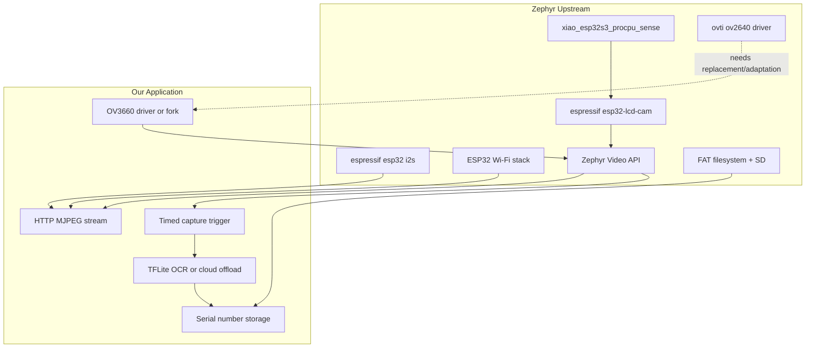
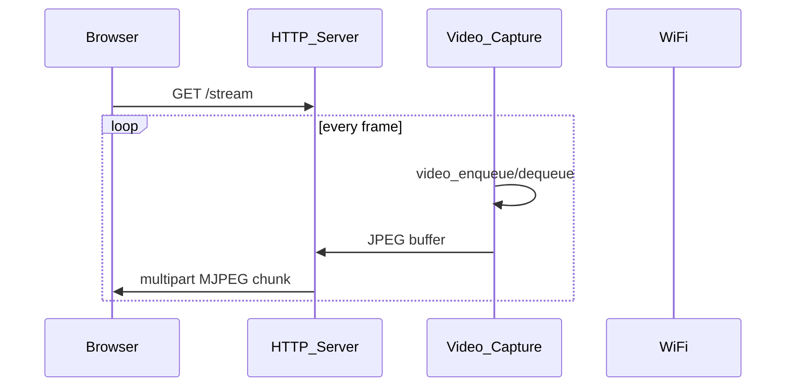

# XIAO ESP32S3 Sense — Zephyr Codebase Plan

## Executive Summary

Build a **West workspace application** on top of upstream Zephyr for the **Seeed Studio XIAO ESP32S3 Sense** (OV3660 camera, PDM microphone, microSD).

| Horizon | Goal |
|---|---|
| Near-term | Reliable **Wi-Fi streaming** of camera (optionally audio) |
| Long-term | **Scheduled capture + OCR** to read and store part serial numbers |

This document is the living design plan. Application code follows phased bring-up in [docs/phases.md](docs/phases.md).

---

## Project Layout

West workspace pattern — this repo is an external application checked out beside upstream Zephyr:

```text
~/zephyrproject/
├── zephyr/                          # upstream Zephyr (west manifest)
├── modules/                         # HAL blobs, etc.
└── applications/
    └── xiao_esp32s3_sense_zephyr/   # THIS REPO
        ├── ZEPHYR_PLAN.md
        ├── README.md
        ├── app/                       # Zephyr application (phased)
        └── docs/
            ├── hardware.md
            ├── phases.md
            └── arduino-mapping.md
```

**Board target:** `xiao_esp32s3/xiao_esp32s3_procpu/sense` (Sense variant, merged Zephyr v4.0.0)

**Reference repos (mine, do not fork wholesale):**

- [limengdu/SeeedStudio-XIAO-ESP32S3-Sense-camera](https://github.com/limengdu/SeeedStudio-XIAO-ESP32S3-Sense-camera) — pin maps, OV3660 tuning, capture flow
- [Cosmic-Bee/xiao-zephyr-examples](https://github.com/Cosmic-Bee/xiao-zephyr-examples) — board overlays, SD card config
- Upstream Zephyr: [`boards/seeed/xiao_esp32s3/xiao_esp32s3_procpu_sense.dts`](https://github.com/zephyrproject-rtos/zephyr/blob/main/boards/seeed/xiao_esp32s3/xiao_esp32s3_procpu_sense.dts)

---

## Hardware Inventory

### SoC / Board

| Resource | Detail |
|---|---|
| MCU | ESP32-S3 dual-core, 240 MHz |
| Flash | 8 MB |
| PSRAM | 8 MB (required for camera buffers) |
| USB | USB-C serial/JTAG |
| Build target | `-b xiao_esp32s3/xiao_esp32s3_procpu/sense` |

### Camera (OV3660) — DVP + I2C SCCB

14 GPIOs consumed by the Sense expansion board:

| GPIO | Signal |
|---|---|
| 10 | XMCLK |
| 11 | DVP_Y8 |
| 12 | DVP_Y7 |
| 13 | DVP_PCLK |
| 14 | DVP_Y6 |
| 15 | DVP_Y2 |
| 16 | DVP_Y5 |
| 17 | DVP_Y3 |
| 18 | DVP_Y4 |
| 38 | DVP_VSYNC |
| 39 | CAM SCL |
| 40 | CAM SDA |
| 47 | DVP_HREF |
| 48 | DVP_Y9 |

**Critical gap:** Upstream Zephyr Sense devicetree declares **OV2640** (`ovti,ov2640` at I2C `0x30`). This board has **OV3660**. The Arduino reference repo branches on `OV3660_PID` for flip, brightness, and saturation. Phase 2 requires an **OV3660 sensor driver or overlay adaptation** — highest-risk item.

### Microphone (PDM)

| GPIO | Signal |
|---|---|
| 41 | PDM DATA |
| 42 | PDM CLK |

Sensor: MSM261D3526H1CPM. Stable Arduino config: **16 kHz, 16-bit, mono PDM**.

**Zephyr gap:** ESP32-S3 I2S driver exists upstream; PDM/DMIC binding may need verification on the chosen Zephyr version. Phase 3 validates early.

### microSD (SPI)

| GPIO | Signal |
|---|---|
| 21 | CS |
| 7 | SCK |
| 8 | MISO |
| 9 | MOSI |

Already wired in upstream Sense DTS via `spi2` + `zephyr,sdhc-spi-slot`.

### Pin Conflicts

- Camera uses GPIO 38 (also user LED on base XIAO)
- Mic uses GPIO 41/42 (A11/A12 on Sense)
- SD CS on GPIO 21
- Install Wi-Fi antenna for reliable streaming

---

## Software Architecture



| Layer | Status | Action |
|---|---|---|
| Board + LCD_CAM DVP | Upstream | Use Sense variant; verify PSRAM Kconfig |
| OV3660 sensor | **Missing** | Port driver or extend OV2640; confirm I2C addr from hardware |
| Video capture | Upstream | Start from `samples/drivers/video/capture` |
| PDM microphone | Partial | Validate I2S PDM on target Zephyr version |
| SD + FAT | Upstream | Start from `samples/subsys/fs/fs_sample` |
| Wi-Fi | Upstream | Start from `samples/net/wifi` |
| HTTP streaming | Build | MJPEG over HTTP via sockets or `CONFIG_HTTP_SERVER` |
| OCR | Build (late) | TFLite Micro on-device, or JPEG POST to backend |

---

## Phased Development

Each phase has one success criterion. Do not combine camera + Wi-Fi + mic until each works in isolation. Full checklists: [docs/phases.md](docs/phases.md).

| Phase | Goal | Pass criterion |
|---|---|---|
| 0 | Toolchain + blank board | `Hello World! xiao_esp32s3` on serial |
| 1 | SD card + filesystem | List/write file on `/SD:` |
| 2 | Camera still capture (OV3660) | Valid `.jpg` on SD, viewable on PC |
| 3 | PDM microphone | Serial loudness plot responds to speech |
| 4 | Wi-Fi connectivity | Join AP, ping from LAN |
| 5 | Camera streaming | Browser shows MJPEG on `:80/stream` |
| 6 | Scheduled OCR | Store `{timestamp, serial, image_path}` for test part |

### Phase 5 streaming flow



**Realistic first target:** QVGA MJPEG at ~5–10 FPS.

### Phase 6 OCR strategy

**Triggers (implement one first):**

- NTP/time-based schedule (after SNTP sync)
- Network command (`POST /capture` from MES/PLC)
- GPIO part-present sensor

**OCR tiers (decide when Phase 5 is stable):**

| Tier | Approach | Trade-off |
|---|---|---|
| A | On-device TFLite Micro | Offline; harder to tune |
| B | POST JPEG to backend OCR | Better accuracy; needs server |

**Recommended:** Start with Tier B to validate the pipeline; migrate to Tier A if offline is required.

---

## Target Application Structure

```text
app/src/
├── main.c              # init, phase-gated startup
├── board_init.c        # PSRAM, pin checks
├── camera/
│   ├── camera.c        # Zephyr video API wrapper
│   └── ov3660.c        # sensor-specific init (if not upstream)
├── storage/
│   └── sd_log.c        # JPEG/WAV/serial log files
├── audio/
│   └── pdm_mic.c       # optional for streaming
├── network/
│   ├── wifi.c
│   └── http_stream.c   # MJPEG + /capture endpoint
└── ocr/
    ├── scheduler.c     # timed/triggered capture
    └── serial_parser.c # regex/validation of part numbers
```

Phase-gated Kconfig (incremental bring-up):

```kconfig
CONFIG_APP_PHASE_SD=y
CONFIG_APP_PHASE_CAMERA=n
CONFIG_APP_PHASE_MIC=n
CONFIG_APP_PHASE_WIFI=n
CONFIG_APP_PHASE_STREAM=n
CONFIG_APP_PHASE_OCR=n
```

---

## Arduino → Zephyr Mapping

See [docs/arduino-mapping.md](docs/arduino-mapping.md) for the full table. Summary:

| Arduino | Zephyr |
|---|---|
| `esp_camera_init()` | `video_set_format()` + sensor init |
| `esp_camera_fb_get()` | `video_enqueue/dequeue` buffer pool |
| `camera_config_t` pins | Devicetree pinctrl + Sense overlay |
| PSRAM in IDE | `CONFIG_ESP32S3_SPIRAM=y` |
| `set_vflip()` etc. | OV3660 register writes in driver |
| I2S PDM `setPinsPdmRx(42,41)` | Devicetree I2S PDM node |
| Wi-Fi stream server | Custom HTTP server on Zephyr sockets |

---

## Open Questions / Research Log

Living section — update as hardware testing progresses.

| # | Question | Status | Answer |
|---|---|---|---|
| 1 | OV3660 I2C address (`0x3c` vs `0x30`)? | Open | Run I2C scan on hardware |
| 2 | Zephyr version pin (main vs LTS 3.7+)? | Open | Prefer latest with ESP32-S3 video + I2S |
| 3 | Part serial format (length, charset, barcode vs text)? | Open | Needed for OCR ROI and validation |
| 4 | OCR trigger source for v1? | Open | Time / HTTP / GPIO |
| 5 | Streaming scope — camera-only or camera+audio? | Open | Camera-only MJPEG first recommended |
| 6 | Offline OCR required? | Open | Determines Tier A vs B |

**Agent policy:** Pause and ask the project owner when blocked on any row above or when upstream Zephyr lacks a required driver.

---

## Risk Register

| Risk | Impact | Mitigation |
|---|---|---|
| No upstream OV3660 driver | Blocks Phase 2 | Port from ESP-IDF; budget 1–2 weeks |
| PSRAM misconfiguration | Frame alloc failures | Test heap stats early; follow SPIRAM Kconfig |
| GPIO 38 LED conflict | Confusing debug | Disable LED in overlay when camera active |
| Wi-Fi + camera memory pressure | Crashes under load | QVGA; single client; tune buffer count |
| OCR accuracy | Wrong serial stored | Confidence threshold; retry; store image for audit |
| Windows dev friction | Slow iteration | `west espressif monitor`; document COM port |

---

## References

- [Seeed XIAO ESP32S3 Zephyr wiki](https://wiki.seeedstudio.com/xiao_esp32s3_zephyr_rtos/)
- [Zephyr XIAO ESP32S3 board doc](https://docs.zephyrproject.org/latest/boards/seeed/xiao_esp32s3/doc/index.html)
- [Seeed camera pin wiki (Arduino)](https://wiki.seeedstudio.com/xiao_esp32s3_camera_usage/)
- [Seeed microphone wiki](https://wiki.seeedstudio.com/xiao_esp32s3_sense_mic/)
- [Zephyr getting started](https://docs.zephyrproject.org/latest/develop/getting_started/index.html)
- [Zephyr video capture sample](https://github.com/zephyrproject-rtos/zephyr/tree/main/samples/drivers/video/capture)
